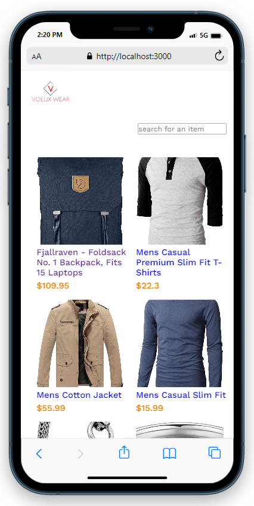
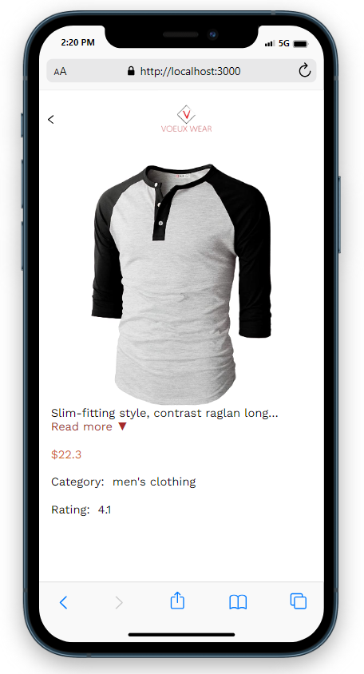

<div align="center">
  <h1>Voeux Wear</h1>
</div>

<!-- TABLE OF CONTENTS -->

# 📖 Table of Contents

- [About the Project](#about-project)
  - [🛠️ Built With](#built-with)
    - [Tech Stack](#tech-stack)
    - [🔑 Key Features](#key-features)
  - [🚀 Live Demo](#live-demo)
  - [💻 Getting Started](#getting-started)
    - [Prerequisites](#prerequisites)
    - [Setup](#setup)
    - [Install](#install)
    - [Run Tests](#run-tests)
    - [Build](#build)
    - [Webpack Development Server](#webpack-development-server)
  - [👤 Author](#author)
  - [🔮 Future Features](#future-features)
  - [🤝 Contributing](#contributing)
  - [⭐️ Show Your Support](#show-your-support)
  - [🙏 Acknowledgments](#acknowledgments)
  - [📝 License](#license)

# 📖 About the Project <a name="about-project"></a>

**Voeux Wear** is a project that displays products fetched from an API  and gives details of each product. Users can search for products with much ease.

<div align="center">
  
  
  <br/>
</div>

## 🛠️ Built With <a name="built-with"></a>

### Tech Stack <a name="tech-stack"></a>

<details>
  <summary>🖥️ Client</summary>
  <ul>
    <li><a href="https://www.w3schools.com/REACT/">React</a></li>
    <li><a href="https://www.w3schools.com/css/">CSS</a></li>
    <li><a href="https://redux.js.org/">Redux</a></li>
  </ul>
</details>

<!-- FEATURES -->

### 🔑 Key Features <a name="key-features"></a>

- ✨ **Fetch Products from API**
- 🏅 **Display details of each product**

<p align="right">(<a href="#readme-top">back to top</a>)</p>

<!-- LIVE DEMO -->

## 🚀 Live Demo <a name="live-demo"></a>

[Live Demo](https://voeux-wear.onrender.com/)
[Loom Video](https://www.loom.com/share/1cbf16782ca445f1a58d4bb66a217010?sid=00e7dece-2c67-42af-b962-9fefaaf1334d)

<p align="right">(<a href="#readme-top">back to top</a>)</p>
<!-- GETTING STARTED -->

## 💻 Getting Started <a name="getting-started"></a>

### Prerequisites

To run this project, you need the following:

- 🌐 Mobile simulator extension on web browser
- 🐙 Git
- 👨‍💻 Code Editor

### Setup

Clone this repository to your desired folder:

```bash
git clone https://github.com/fatmahussein/voeux-wear.git
```

### Install

To install all dependencies, run the following command:

```bash
npm install
```

### Run Tests

To run tests, use the following commands:

- To track CSS linter errors, run:

```bash
npx stylelint "**/*.{css,scss}"
```

- To track JavaScript linter errors, run:

```bash
npx eslint "**/*.{js,jsx}"
```

### Build

To build the project, run the following command:

```bash
npm run build
```

### Webpack Development Server

To run the webpack development server, execute the following command:

```bash
npm start
```

<p align="right">(<a href="#readme-top">back to top</a>)</p>

<!-- AUTHOR -->

## 👤 Author <a name="author"></a>

👤 Fatuma Hussein

- GitHub: [@fatmahussein](https://github.com/fatmahussein)

<p align="right">(<a href="#readme-top">back to top</a>)</p>

<!-- FUTURE FEATURES -->

## 🔮 Future Features <a name="future-features"></a>

- [ ] 📱 **Add some styles**

<p align="right">(<a href="#readme-top">back to top</a>)</p>

<!-- CONTRIBUTING -->

## 🤝 Contributing <a name="contributing"></a>

Contributions are welcome! If you would like to contribute, please follow these guidelines:

Feel free to check the [issues page](https://github.com/fatmahussein/voeux-wear/issues).

<p align="right">(<a href="#readme-top">back to top</a>)</p>

<!-- SHOW YOUR SUPPORT -->

## ⭐️ Show Your Support <a name="show-your-support"></a>

If you like this project, give it a ⭐️.

<p align="right">(<a href="#readme-top">back to top</a>)</p>

<!-- ACKNOWLEDGEMENTS -->

## 🙏 Acknowledgments <a name="acknowledgments"></a>

I would like to thank Microverse for providing guidance and support during the development of this project.

I would like to give credit to [Nelson Sakwa](https://www.behance.net/sakwadesignstudio) the [author of the original design](https://www.behance.net/gallery/31579789/Ballhead-App-(Free-PSDs)), as required by the [Creative Commons License](https://creativecommons.org/licenses/).

<p align="right">(<a href="#readme-top">back to top</a>)</p>

<!-- LICENSE -->

## 📝 License <a name="license"></a>

This project is licensed under the [MIT License](./LICENSE).

<p align="right">(<a href="#readme-top">back to top</a>)</p>
